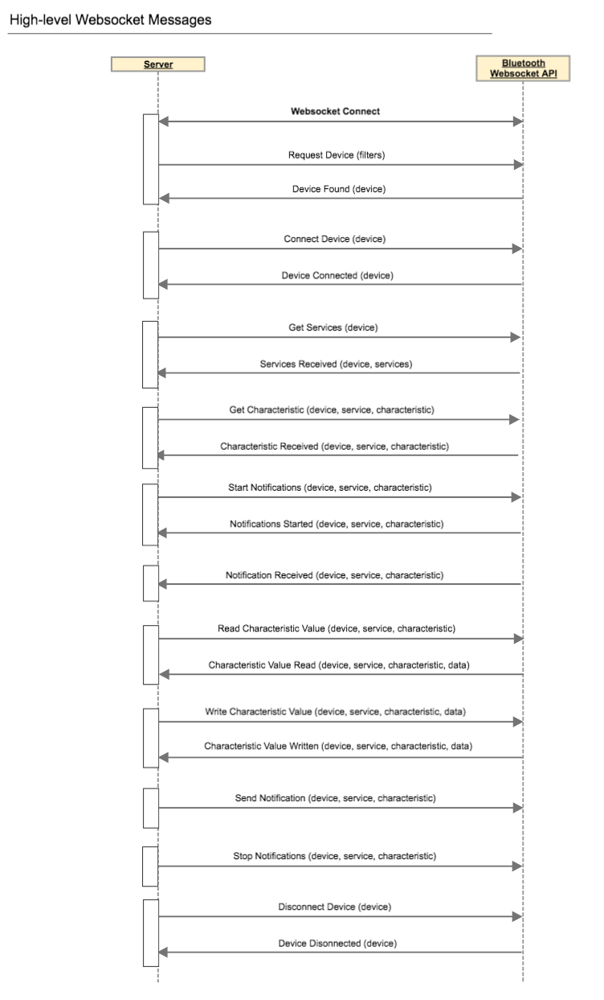

# Bluetooth Websocket API

The Bluetooth WebSocket API is an abstraction layer on top of the [Web Bluetooth](https://webbluetoothcg.github.io/web-bluetooth) JavaScript API. The Web Bluetooth API allows websites to connect and interact with Bluetooth Low Energy devices. The library does not introduces a new API but extends the JavaScript functions as WebSocket messages. This can be handy when you want to write Bluetooth enabled webapps and already have an implementation on the server.

As the Bluetooth operations are dictated by the server, the front-end setup is straight forward. The Bluetooth search command, connect and communication are all initiated by the server side.

There are many different protocols on top of the WebSocket standard. The library has been designed while having this in mind, hence there is a separation between the library core and WebSocket adapter. Today [Phoenix framework](http://phoenixframework.org) WebSocket channels are supported.

## Requirements

- Android6.0+, Chrome OS or OS X. The full list of supported hardware is all the time updated by the Web Bluetooth workgroup
- Chrome v50+
- HTTPS due to WebBluetooth security requirements

## Features/Usage
  This library consists of three parts:

- Core

  Handles the Web Bluetooth API and maps functions to the WebSocket adapter.

- Adapter

  WebSocket specific implementation, formats and sends the messages back/forth between Core and the server.

- App

  An example app of usage is included in the repo, this can be used together with the Phoenix server reference app [Bluetooth WebSocket Server](https://github.com/highmobility/bluetooth-websocket-server).

Below is a simplified chart showing the different Bluetooth messages passed through the library.

For more detail of each socket event please see the Wiki page [Wiki - Socket messages specification](https://github.com/highmobility/bluetooth-websocket-api/wiki/Socket-messages-specification).

## Installation of reference app

### To start your app
  Install node_module with `npm install`

### To use SSL on localhost with WebBluetoothAPI
  1. Generate key with `openssl genrsa -out localhost.key 2048`
  2. Generate cert with `openssl req -new -x509 -key localhost.key -out localhost.cert -days 3650 -subj /CN=localhost`
  3. Put them in a directory `/keys/`
  4. Start server with  `node server.js`

Now you can visit [`localhost:3000`](https://localhost:3000/app/) with SSL from your browser.

### To build js file when you update
  1. Update source file of `app/app/js`
  2. Run build with `npm run build`
  3. The file will be created to `dist/app.js`

### To start your HTTPS server on local:
  `node server.js`

Now you can visit [`localhost:3000/app`](https://localhost:3000/app) from your browser.

Of course you can use your apache server.

## Caution
- The value should be encoded with `base64` when you read/write value.
- `Adapter#requestDevice()` method should be fired by click event (due to WebBluetoothAPI specification).
- `characteristicvaluechanged` event is fired by after not only its value changes but also a value change notification/indication (due to WebBluetoothAPI specification).

## Licence

[MIT](LICENCE)

## Author

[HIGH MOBILITY](http://www.high-mobility.com/)

[Recruit Technologies](http://atl.recruit-tech.co.jp/en/) ([@tkybpp](https://github.com/tkybpp))
